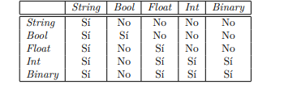
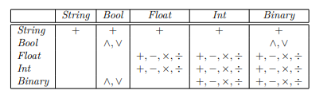

# Scrabble

Interactive graphic programming language heavily inspired by 
[Scratch](https://scratch.mit.edu).
This work is licensed under a
[Creative Commons Attribution 4.0 International License](http://creativecommons.org/licenses/by/4.0/), 
and aims purely to be used with the purpose of teaching in the context of the course 
_CC3002 Metodologías de Diseño y programación_ of the 
[_Computer Sciences Department (DCC)_](https://www.dcc.uchile.cl) of the 
_University of Chile_.

---

## Description
This project is a (simplified) clone of Scratch, developed by Scratch Foundation.

It consists on a block based visual programming language that allows the user to create simple 
programs without any specific programming knowledge.

This Scrabble has 5 basic data types:
- Bool (ScrBool)
- String (ScrString)
- Int (ScrInt)
- Float (ScrFloat)
- Binary (16-bit) (ScrBinary)
    
There are multiple operations for these types:
- Transformation between types, listed in the image down bellow (Sí means yes), the Scr types in
the left can be transformed to those in the right

- Bitwise not (~) (for Scr Binary and Bool)
- Bitwise and (∧)
- Bitwise or (∨)
- Addition (+) or concatenation (for strings)(+)
- Subtraction (-)
- Multiplication (*)
- Division (/)

Each operation can be applied between 2 objects of the same or different types, they are listed down bellow 

---
##Running Scrabble
Coming soon

---
Documentation available at `javaDoc/index.html`